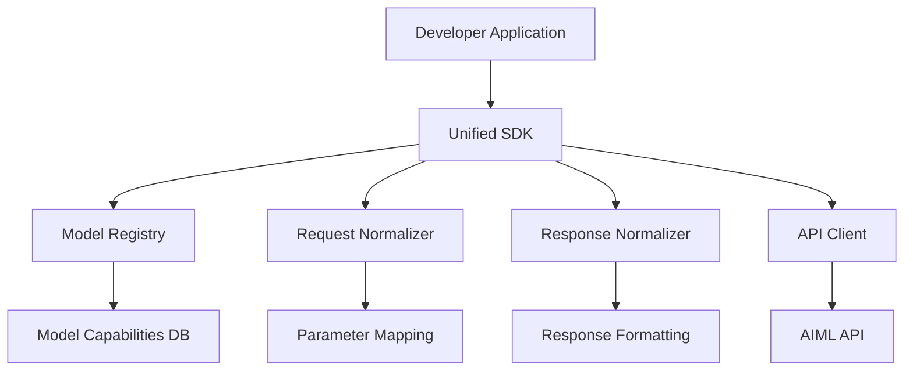

# Design Document

## Overview

The AIML Unified SDK addresses the current limitation where AIML API users must rely on the OpenAI SDK with custom base URL configuration. While AIML API provides OpenAI-compatible endpoints, different models may have varying parameter requirements, response formats, and capabilities. Our unified SDK will provide a consistent, optimized interface specifically designed for AIML API's ecosystem.

## Research Findings

Based on analysis of existing implementations:
- AIML API currently relies on OpenAI SDK compatibility (`base_url = "https://api.aimlapi.com/v1"`)
- Community projects like `aimlapi-vercel-ai` show demand for better integration
- Different models have varying parameter support and response formats
- No official AIML-specific SDK exists, creating opportunity for standardization

## Architecture

### High-Level Architecture



### Core Components

#### 1. Unified SDK Interface
- Single entry point for all model interactions
- Fluent API design for method chaining
- TypeScript-first with comprehensive type definitions
- Support for async/await and Promise patterns

#### 2. Model Registry
- Maintains catalog of available models and their capabilities
- Automatic model discovery via `/models` endpoint
- Capability mapping (text generation, chat, embeddings, etc.)
- Model-specific parameter validation

#### 3. Request Normalizer
- Translates unified parameters to model-specific formats
- Handles parameter validation and defaults
- Supports both common parameters and model-specific overrides
- Request preprocessing and optimization

#### 4. Response Normalizer
- Standardizes response formats across all models
- Consistent error handling and reporting
- Token usage and cost tracking normalization
- Metadata extraction and formatting

#### 5. API Client
- HTTP client with built-in retry logic
- Rate limiting and quota management
- Authentication handling
- Request/response logging and monitoring

## Components and Interfaces

### Core SDK Interface

```typescript
interface UnifiedSDK {
  // Model selection and configuration
  model(modelId: string): ModelInterface;
  
  // Direct method access
  chat: ChatInterface;
  completion: CompletionInterface;
  embedding: EmbeddingInterface;
  
  // Utility methods
  listModels(): Promise<ModelInfo[]>;
  getModelInfo(modelId: string): Promise<ModelInfo>;
}

interface ModelInterface {
  // Fluent API for model-specific operations
  chat(options: ChatOptions): Promise<ChatResponse>;
  complete(options: CompletionOptions): Promise<CompletionResponse>;
  embed(options: EmbeddingOptions): Promise<EmbeddingResponse>;
  
  // Streaming support
  streamChat(options: ChatOptions): AsyncIterable<ChatChunk>;
  streamCompletion(options: CompletionOptions): AsyncIterable<CompletionChunk>;
}
```

### Configuration System

```typescript
interface SDKConfig {
  apiKey: string;
  baseUrl?: string;
  timeout?: number;
  retryConfig?: RetryConfig;
  rateLimiting?: RateLimitConfig;
  logging?: LoggingConfig;
}

interface RetryConfig {
  maxRetries: number;
  backoffMultiplier: number;
  maxBackoffTime: number;
}
```

### Model Registry Schema

```typescript
interface ModelInfo {
  id: string;
  name: string;
  developer: string;
  description: string;
  contextLength: number;
  capabilities: ModelCapability[];
  parameters: ParameterSchema;
  pricing?: PricingInfo;
}

interface ModelCapability {
  type: 'chat' | 'completion' | 'embedding' | 'image';
  supported: boolean;
  limitations?: string[];
}
```

## Data Models

### Unified Request/Response Models

```typescript
// Chat Interface
interface ChatOptions {
  messages: ChatMessage[];
  model?: string;
  temperature?: number;
  maxTokens?: number;
  stream?: boolean;
  // Model-specific parameters
  modelSpecific?: Record<string, any>;
}

interface ChatResponse {
  id: string;
  model: string;
  choices: ChatChoice[];
  usage: TokenUsage;
  metadata: ResponseMetadata;
}

// Completion Interface
interface CompletionOptions {
  prompt: string;
  model?: string;
  temperature?: number;
  maxTokens?: number;
  stream?: boolean;
}

// Embedding Interface
interface EmbeddingOptions {
  input: string | string[];
  model?: string;
  dimensions?: number;
}
```

### Normalized Response Format

```typescript
interface UnifiedResponse<T> {
  success: boolean;
  data?: T;
  error?: SDKError;
  metadata: {
    model: string;
    requestId: string;
    timestamp: number;
    processingTime: number;
    usage?: TokenUsage;
    cost?: CostInfo;
  };
}

interface TokenUsage {
  promptTokens: number;
  completionTokens: number;
  totalTokens: number;
}
```

## Error Handling

### Error Classification System

```typescript
enum ErrorType {
  AUTHENTICATION = 'authentication',
  RATE_LIMIT = 'rate_limit',
  MODEL_NOT_FOUND = 'model_not_found',
  INVALID_PARAMETERS = 'invalid_parameters',
  NETWORK_ERROR = 'network_error',
  API_ERROR = 'api_error',
  TIMEOUT = 'timeout'
}

interface SDKError {
  type: ErrorType;
  message: string;
  code?: string;
  details?: any;
  retryable: boolean;
  retryAfter?: number;
}
```

### Error Recovery Strategies

- Automatic retry with exponential backoff for transient errors
- Rate limit handling with intelligent backoff
- Fallback model selection for unavailable models
- Graceful degradation for partial failures

## Testing Strategy

### Unit Testing
- Component isolation testing
- Mock API responses for consistent testing
- Parameter validation testing
- Error handling verification

### Integration Testing
- End-to-end API communication testing
- Model compatibility verification
- Rate limiting behavior testing
- Authentication flow testing

### Performance Testing
- Response time benchmarking
- Memory usage profiling
- Concurrent request handling
- Rate limit compliance testing

### Compatibility Testing
- Multiple Node.js versions
- Browser environment testing
- TypeScript version compatibility
- Different model combinations

## Implementation Phases

### Phase 1: Core Foundation
- Basic SDK structure and configuration
- API client with authentication
- Simple model registry implementation
- Basic chat and completion interfaces

### Phase 2: Advanced Features
- Request/response normalization
- Streaming support
- Error handling and retry logic
- Comprehensive model registry

### Phase 3: Enhanced Capabilities
- Rate limiting and quota management
- Usage tracking and analytics
- Advanced parameter mapping
- Performance optimizations

### Phase 4: Developer Experience
- Comprehensive documentation
- Code examples and tutorials
- CLI tools for testing
- Community feedback integration

## Security Considerations

- Secure API key storage and transmission
- Input validation and sanitization
- Rate limiting to prevent abuse
- Audit logging for security monitoring
- No sensitive data in logs or error messages

## Performance Optimizations

- Connection pooling and keep-alive
- Request batching where possible
- Intelligent caching of model metadata
- Lazy loading of model capabilities
- Memory-efficient streaming implementation